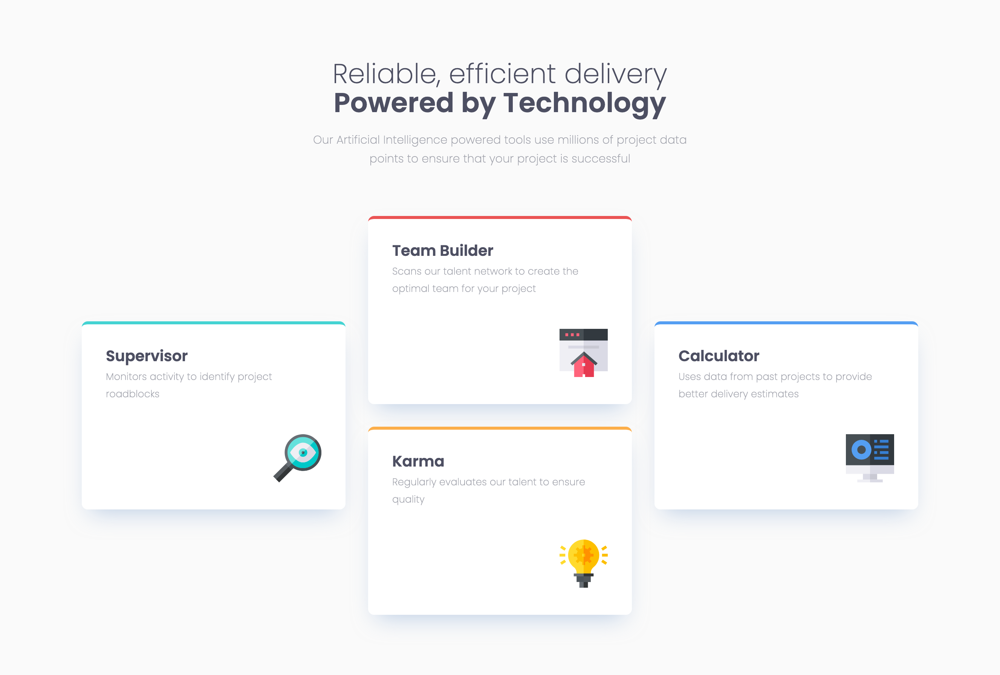

# Frontend Mentor - Four card feature section solution

This is a solution to the [Four card feature section challenge on Frontend Mentor](https://www.frontendmentor.io/challenges/four-card-feature-section-weK1eFYK). Frontend Mentor challenges help you improve your coding skills by building realistic projects.

## Table of contents

- [Overview](#overview)
  - [Screenshot](#screenshot)
  - [Links](#links)
- [My process](#my-process)
  - [Built with](#built-with)
- [Author](#author)
- [Acknowledgments](#acknowledgments)

## Overview

Great opportunity to practice grids and flexbox. Second challenge of the "Buildin responsive layouts" learning path.

### Screenshot

### Links

- Solution URL: [Four Card Feature Section - GitHub Repo](https://github.com/dealencardavid/four-card-feature-section_frontendmentor)
- Live Site URL: [Four Card Feature Section Page Live](https://dealencardavid.github.io/four-card-feature-section_frontendmentor/)

## My process

### Built with

- Semantic HTML5 markup
- CSS custom properties
- Flexbox
- CSS Grid

## Author

- Frontend Mentor - [@dealencardavid](https://www.frontendmentor.io/profile/dealencardavid)
- GitHub - [@dealencardavid](https://github.com/dealencardavid)

## Acknowledgments

Hats off to FrontendMentor for enabling goood resources to new frontend developers!
